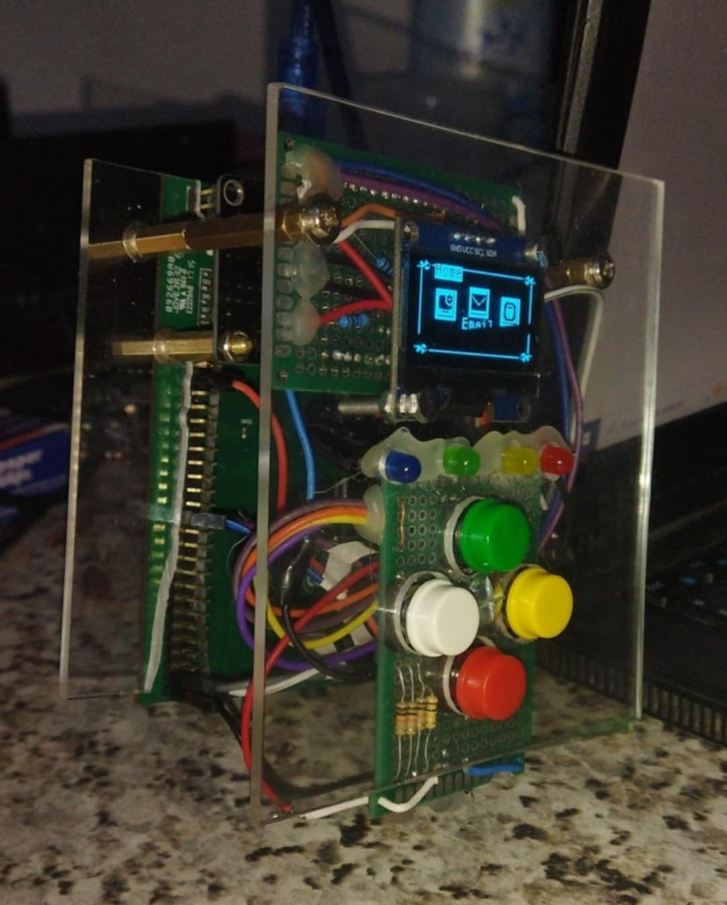

# STM32F407 Multi-Function Desktop System



## 🎯 Overview

A comprehensive embedded system combining **STM32F407 Discovery Board** with **ESP8266 board**, featuring an OLED display interface, USB HID keyboard support, retro gaming capabilities, and wireless email functionality. This project demonstrates advanced embedded systems concepts including **FreeRTOS multitasking**, **I2C communication**, **UART communication**, and **WiFi networking**.

---

## 🚀 Tech Stack

<div align="center">

| Technology | Description |
|------------|-------------|
|  | Core embedded programming language |
|  | STM32F407VGT6 microcontroller |
|  | WiFi connectivity module |
|  | Real-time operating system |
|  | ESP8266 programming framework |

</div>

### Hardware Components
- **MCU**: STM32F407VGT6 (ARM Cortex-M4, 168MHz)
- **Display**: SH1106 OLED (128x64 pixels, I2C)
- **WiFi**: ESP8266 Board
- **Input**: USB HID Keyboard + 4 Push Buttons (Exit, Confirm, Up, Down)
- **LEDs**: 4x GPIO-controlled LEDs (Green, Orange, Red, Blue)
- **Sensors**: 
  - HC-SR04 Ultrasonic Distance Sensor (2-400 cm range)
  - Infrared Color Detection Sensor (Black/White detection)
- **Communication**: UART, I2C, USB Host

### Software Stack
- **HAL Library**: STM32F4xx HAL Driver
- **RTOS**: FreeRTOS v10.x
- **USB**: USB Host Library with HID support
- **Email**: ESP_Mail_Client library
- **Storage**: EEPROM (WiFi credential persistence)

---

## ✨ Features

### 🖥️ Multi-Mode Desktop Interface
- **Home Screen**: Carousel-style menu with 6 applications
- **Email Client**: Send emails via Gmail SMTP
- **Calculator**: Full-featured calculator with basic operations
- **Games**: 3 retro games (Snake, Pong, Tetris)
- **Sensors**: Real-time distance and color detection monitoring
- **Settings**: WiFi configuration interface
- **System Info**: Real-time system monitoring

### 🎮 Gaming System
- **Snake Game**: Classic snake with collision detection
- **Pong Game**: Single-player pong with AI paddle
- **Tetris Game**: Block-stacking puzzle game
- Pause/Resume functionality
- Score tracking
- Game Over and restart screens

### 📧 Email Functionality
- USB keyboard text input (2000 character buffer)
- Send emails via Gmail SMTP
- Custom recipient configuration
- Real-time status updates
- Email confirmation screen

### 📶 WiFi Management
- ESP8266 board integration
- EEPROM-based credential storage
- Dynamic WiFi configuration via keyboard
- Auto-reconnection
- IP address monitoring

### � Sensor System
- **Ultrasonic Distance Sensor (HC-SR04)**:
  - Range: 2-400 cm with 0.01 cm precision
  - Trigger pin: PE7, Echo pin: PE8
  - Real-time distance measurement
  - Update rate: 200ms
- **Infrared Color Sensor**:
  - Black/White surface detection
  - Digital output: HIGH (white), LOW (black)
  - Pin: PE8 (shared with ultrasound echo)
- **Sensor Menu Navigation**: Select and switch between sensors
- **Live Readings Display**: Real-time sensor data on OLED
- **GPIO Conflict Management**: Sensors initialize only when selected

### �🔧 Advanced Features
- **FreeRTOS Multitasking**: 6+ concurrent tasks with priority management
- **USB HID Support**: Full keyboard mapping (alphanumeric, symbols, modifiers)
- **Thread-Safe Operations**: Mutexes and semaphores for resource protection
- **UART Communication**: STM32 ↔ ESP8266 bidirectional protocol
- **LED Control**: Dynamic LED state management
- **Button Debouncing**: Hardware debouncing with 50ms delay

---

## 📋 System Architecture

### FreeRTOS Task Structure

```
┌─────────────────────────────────────────────────┐
│              STM32F407 System                   │
├─────────────────────────────────────────────────┤
│  Task Name       │ Priority │ Stack │ Function  │
├──────────────────┼──────────┼───────┼───────────┤
│ ButtonTask       │    4     │  256  │ Highest   │
│ ESP_ReceiveTask  │    3     │  768  │ High      │
│ KeyboardTask     │    2     │  768  │ Normal    │
│ DisplayTask      │    2     │  768  │ Normal    │
│ GameUpdateTask   │    2     │  256  │ Normal    │
│ ESP_SendTask     │    1     │  256  │ Low       │
└──────────────────┴──────────┴───────┴───────────┘
```

### Communication Protocol (STM32 ↔ ESP8266)

**STM32 → ESP8266 Commands:**
```
EMAIL:<recipient>:<text>    - Send email
CHAR:<character>            - Stream text character
WIFI_CONFIG:<ssid>:<pass>   - Configure WiFi
LED_STATUS                  - Request LED states
```

**ESP8266 → STM32 Responses:**
```
ACK:<message>               - Acknowledgment
EMAIL_STATUS:<status>       - Email operation status
WIFI:<status>               - WiFi connection status
DISPLAY:<message>           - Display message on OLED
IP:<address>                - ESP8266 IP address
```

### Hardware Connections

```
STM32F407 Discovery Board
┌────────────────────────────────────┐
│  I2C1 (PB6/PB7) ────────► SH1106 OLED Display
│  USART6 (PC6/PC7) ──────► ESP8266 (TX/RX)
│  USART2 (PA2/PA3) ──────► Debug/Monitor
│  USB OTG FS ────────────► USB Keyboard
│  PC1 ───────────────────► Exit Button
│  PC2 ───────────────────► Confirm/OK Button
│  PC3 ───────────────────► Up/Previous Button
│  PC4 ───────────────────► Down/Next Button
│  PE7 ───────────────────► Ultrasound Trigger
│  PE8 ───────────────────► Ultrasound Echo / IR Sensor
│  PD12-15 ───────────────► LEDs (G/O/R/B)
└────────────────────────────────────┘

ESP8266 Board
┌────────────────────────────────────┐
│  UART ──────────────────► STM32 USART6
│  WiFi ──────────────────► Internet/SMTP
│  EEPROM ────────────────► WiFi Credentials
└────────────────────────────────────┘
```

---

## 🧠 Logic & Workflow

### 1. System Initialization
```
Power On
   ↓
HAL_Init() → Clock Config → Peripheral Init
   ↓
FreeRTOS Task Creation
 **Input**: USB HID Keyboard + 4 Push Buttons
Main Loop (Scheduler Running)
```
 **FreeRTOS Multitasking**: Multiple concurrent tasks with priority management
                           │
        ┌──────────────────┼──────────────────┐
        ↓                  ↓                  ↓
   [TEXT MODE]        [CALCULATOR]       [GAME MODE]
        │                  │                  │
        ↓                  ↓                  ↓

│  Task Name        │ Priority │ Stack (words) │ Purpose        │
├───────────────────┼──────────┼───────┼───────────┤
│ defaultTask       │ Normal   │ 128   │ CMSIS-OS hook  │
│ MainLoopTask      │ 2        │ 1024  │ UI + input      │
│ UARTReceiveTask   │ 1        │ 512   │ ESP RX parsing  │
│ DisplayTask       │ 2        │ 512   │ OLED refresh    │
│ GameUpdateTask    │ 2        │ 512   │ Game tick loop  │
### 3. Email Sending Flow
```
User Types on USB Keyboard
   ↓
KEY:<c>                     - Send a single typed character (email/text input)
SEND_EMAIL:<recipient>      - Send collected text via SMTP
WIFI_SSID:<ssid>            - Stage WiFi SSID
WIFI_PASS:<password>        - Stage WiFi password (can be empty)
WIFI_CONNECT                - Apply staged WiFi credentials
GET_IP                      - Request current IP address
CLEAR_TEXT                  - Clear collected text buffer on ESP
GET_TEXT_LEN                - Query collected text length
DisplayTask: Update OLED (8 lines × 21 chars)
   ↓
User Presses Confirm Button
   ↓
   ↓
Format: "EMAIL:<recipient>:<text>"
DISPLAY_UPDATE_TEXT         - Request STM32 to refresh text view
EMAIL:<message>             - Email progress/status messages (includes success/fail)
   ↓
UART → ESP8266
   ↓
ESP8266: SMTP Connection (smtp.gmail.com:465)
│  PC1 ───────────────────► Exit Button
│  PC2 ───────────────────► Confirm/OK Button
│  PC3 ───────────────────► Up/Previous Button
│  PC4 ───────────────────► Down/Next Button
   ↓
Email Transmission
   ↓
Status → STM32 → OLED Display
   ↓
Success/Failure Notification
Format: "SEND_EMAIL:<recipient>"

### 4. Game Loop (Snake Example)
```
Game_Start(GAME_SNAKE)
   ↓
Snake_Init() → Reset snake position, spawn food
   ↓
┌─► GameUpdateTask (200ms interval)
│      ↓
│   Snake_Update()
│      ├─► Move snake head
│      ├─► Check collision (wall/self)
│      ├─► Check food collision
│      └─► Update score
│      ↓
│   Snake_Draw() → Frame buffer
│      ↓
│   SH1106_UpdateScreen() → I2C transfer
│      ↓
│   Handle Input (Button interrupts)
│      ├─► Change direction
│      └─► Pause/Exit
│      ↓
└───┤ Game Over? ├─No─┘
         │ Yes
         ↓
    Display Score
         ↓
    Wait for Restart
```

### 5. WiFi Configuration Flow
```
Settings Mode → Keyboard Input
   ↓
Edit SSID field (max 32 chars)
   ↓
Switch to Password field
   ↓
Edit Password (max 64 chars)
   ↓
Confirm Button
   ↓
Format: "WIFI_CONFIG:<ssid>:<password>"
   ↓
UART → ESP8266
   ↓
ESP8266: WiFi.disconnect()
   ↓
WiFi.begin(new_credentials)
   ↓
Connection Attempt (20s timeout)
   ↓
Success? ─No─► Error Message → Retry old WiFi
   │ Yes
   ↓
saveWiFiCredentials() → EEPROM
   ↓
Send IP Address → STM32
   ↓
Display: "WiFi Connected!"
```

### 6. Thread Synchronization
```
┌─────────────────┐     ┌─────────────────┐
│  Keyboard Task  │────►│  Display Mutex  │
└─────────────────┘     └─────────────────┘
                               ▲
┌─────────────────┐            │
│  Display Task   │────────────┘
└─────────────────┘     ┌─────────────────┐
                        │   I2C Mutex     │
┌─────────────────┐     └─────────────────┘
│  ESP Send Task  │────►│   UART Mutex    │
└─────────────────┘     └─────────────────┘
                               ▲
┌─────────────────┐            │
│ ESP Receive Task│────────────┘
└─────────────────┘     ┌─────────────────┐
                        │ Button Semaphore│
┌─────────────────┐     └─────────────────┘
│   Button Task   │────►│ Debounce Logic  │
└─────────────────┘     └─────────────────┘
```

---

## 🔧 Getting Started

### Prerequisites
- **STM32CubeIDE** (v1.9.0 or later)
- **Arduino IDE** (v1.8.x or later) for ESP8266
- **ESP8266 Board Package** (install via Arduino Board Manager)
- **ESP_Mail_Client Library** (install via Arduino Library Manager)
- **STM32CubeMX** (optional, for hardware configuration)

### Hardware Setup
1. Connect **SH1106 OLED** to STM32F407:
   - SDA → PB7 (I2C1_SDA)
   - SCL → PB6 (I2C1_SCL)
   - VCC → 3.3V
   - GND → GND

2. Connect **ESP8266** to STM32F407:
   - ESP8266 TX → PC7 (USART6_RX)
   - ESP8266 RX → PC6 (USART6_TX)
   - VCC → 3.3V (with proper current supply)
   - GND → GND

3. Connect **Push Buttons**:
   - Exit Button → PC1 (with pull-up)
   - Confirm Button → PC2 (with pull-up)
   - Up Button → PC3 (with pull-up)
   - Down Button → PC4 (with pull-up)

4. Connect **Sensors**:
   - **HC-SR04 Ultrasonic Sensor**:
     - VCC → 5V
     - GND → GND
     - Trig → PE7
     - Echo → PE8
   - **Infrared Color Sensor**:
     - VCC → 3.3V or 5V (check sensor specifications)
     - GND → GND
     - OUT → PE8 (shares pin with ultrasound echo)

5. Connect **USB Keyboard** to USB OTG FS port

### Software Setup

#### 1. ESP8266 Configuration
```cpp
// Edit in codeESP8266.ino
String ssid = "YourWiFiSSID";
String password = "YourWiFiPassword";

#define AUTHOR_EMAIL "your-email@gmail.com"
#define AUTHOR_PASSWORD "your-app-password"  // Gmail App Password
```

#### 2. Build STM32 Project
```bash
# In STM32CubeIDE
1. File → Import → Existing Projects into Workspace
2. Select "StmProject" folder
3. Build Project (Ctrl+B)
4. Flash to STM32F407 (Run → Debug or F11)
```

#### 3. Flash ESP8266
```bash
# In Arduino IDE
1. File → Open → codeESP8266.ino
2. Tools → Board → ESP8266 Boards → Generic ESP8266
3. Tools → Port → Select your COM port
4. Upload (Ctrl+U)
```

---

## 📖 Usage

### Navigation
- **Exit Button (PC1)**: Exit current mode, navigate back to menu
- **Confirm Button (PC2)**: Select item, perform action
- **Up Button (PC3)**: Navigate up, previous item
- **Down Button (PC4)**: Navigate down, next item
- **USB Keyboard**: Type text, calculator input

### Modes

#### Email Mode
1. Select "Email" from home screen
2. Type message using USB keyboard
3. Press Confirm to open email setup
4. Type recipient email address
5. Press Confirm to send

#### Calculator Mode
1. Select "Calc" from home screen
2. Type numbers and operators (+, -, *, /)
3. Press '=' for result
4. Press 'C' to clear

#### Game Mode
1. Select "Games" from home screen
2. Choose game: Snake, Pong, or Tetris
3. Use Up/Down buttons to control
4. Confirm button to pause
5. Navigate to exit confirmation

#### Sensors Mode
1. Select "Sensors" from home screen
2. Choose sensor using Up/Down buttons:
   - **Distance**: Ultrasonic distance measurement
   - **Color**: Infrared black/white detection
3. Press Confirm to start sensor reading
4. View real-time sensor data on display
5. Press Exit or Confirm to return to sensor menu

#### Settings Mode
1. Select "Settings" from home screen
2. Edit SSID (type and press Enter)
3. Edit Password (type and press Enter)
4. Confirm to apply new WiFi settings

---

## 📁 Project Structure

```
ProjetSystemeTR/
├── StmProject/                 # STM32 Main Project
│   ├── Core/
│   │   ├── Inc/                # Header files
│   │   │   ├── main.h          # Main definitions
│   │   │   ├── game.h          # Game structures
│   │   │   ├── sensors.h       # Sensor definitions
│   │   │   ├── SH1106.h        # OLED driver
│   │   │   └── fonts.h         # Display fonts
│   │   ├── Src/                # Source files
│   │   │   ├── main.c          # Main program (2303 lines)
│   │   │   ├── game.c          # Game logic (595 lines)
│   │   │   ├── sensors.c       # Sensor implementation (294 lines)
│   │   │   ├── SH1106.c        # OLED implementation
│   │   │   ├── freertos.c      # RTOS configuration
│   │   │   └── fonts.c         # Font data
│   │   └── Startup/            # Startup code
│   ├── Drivers/                # HAL drivers
│   ├── Middlewares/            # USB & FreeRTOS
│   ├── Debug/                  # Build output
│   └── *.ioc                   # STM32CubeMX config
│
├── codeESP8266/                # ESP8266 Firmware
│   └── codeESP8266.ino         # WiFi & Email handler (617 lines)
│
├── image.jpeg                  # Project image
└── README.md                   # This file
```

---

## 🎯 Key Algorithms

### Ultrasonic Distance Measurement
```c
// HC-SR04 measurement algorithm
// 1. Send 10µs trigger pulse
HAL_GPIO_WritePin(TRIG_PORT, TRIG_PIN, SET);
delay_us(10);
HAL_GPIO_WritePin(TRIG_PORT, TRIG_PIN, RESET);

// 2. Measure echo pulse duration
startTime = timer_start();
while (ECHO_PIN == LOW); // Wait for echo start
while (ECHO_PIN == HIGH); // Wait for echo end
endTime = timer_stop();

// 3. Calculate distance (speed of sound = 343 m/s)
distance_cm = (duration_us * 0.0343) / 2;

// 4. Validate range (2-400 cm)
if (distance < 2 || distance > 400) return last_valid;
```

### Infrared Color Detection
```c
// Digital IR sensor reading
// HIGH = White surface (high reflectivity)
// LOW = Black surface (low reflectivity)
GPIO_PinState state = HAL_GPIO_ReadPin(IR_PORT, IR_PIN);
bool isWhite = (state == GPIO_PIN_SET);
```

### Text Buffer Management
- **Circular buffer** for UART RX with overflow protection
- **Ring buffer** implementation for interrupt-safe data reception
- **Line wrapping** algorithm for 21-character display lines

### Debouncing Algorithm
```c
// Software debouncing with 50ms delay
if (currentState != lastState) {
    if ((currentTime - lastDebounceTime) > DEBOUNCE_DELAY) {
        processButtonPress();
        lastDebounceTime = currentTime;
    }
}
```

### Snake Collision Detection
```c
// Wall collision
if (head.x < 0 || head.x >= GAME_WIDTH || head.y < 0 || head.y >= GAME_HEIGHT)
    return GAME_OVER;

// Self collision
for (int i = 1; i < snake.length; i++) {
    if (head.x == snake.segments[i].x && head.y == snake.segments[i].y)
        return GAME_OVER;
}
```

---

## 🔒 Security Features
- **EEPROM encryption** for WiFi credentials (magic byte verification)
- **Gmail App Password** support (no plain password storage)
- **Input validation** (buffer overflow protection)
- **Watchdog timer** on ESP8266 (prevent hang)

---

## 🐛 Troubleshooting

| Issue | Solution |
|-------|----------|
| OLED not displaying | Check I2C connections (SDA/SCL), verify address 0x3C |
| Keyboard not detected | Ensure USB Host mode enabled, check USB cable |
| ESP8266 not responding | Verify UART baudrate (115200), check TX/RX crossover |
| Email not sending | Verify Gmail App Password, check WiFi connection |
| Game lag | Increase `gameSpeed` value in game.c |
| WiFi connection fails | Check SSID/password, verify ESP8266 power supply |
| Sensors not reading | Check PE7/PE8 connections, verify sensor power (5V for HC-SR04) |
| Distance sensor timeout | Ensure no GPIO conflicts, check echo pin connection |
| IR sensor always white/black | Verify sensor orientation, check detection distance (<5cm typical) |

---

## 📊 Performance Metrics
- **Display Update Rate**: 60 FPS (I2C @ 400kHz)
- **Game Tick Rate**: 5 FPS (200ms per update)
- **Sensor Update Rate**: 5 Hz (200ms interval)
- **Distance Sensor Accuracy**: ±0.3 cm
- **UART Baudrate**: 115200 bps
- **Keyboard Scan Rate**: 100ms
- **Button Debounce**: 50ms
- **Email Send Time**: ~2-3 seconds (network dependent)

---

## 🔮 Future Enhancements
- [ ] WiFi access point mode for initial configuration
- [ ] Web server for remote control
- [ ] File system support (SD card)
- [ ] More games (Space Invaders, Breakout)
- [ ] Calendar and reminder system
- [ ] Additional sensors (temperature, humidity, light)
- [ ] Sensor data logging and graphing
- [ ] Bluetooth support
- [ ] Multi-language support

---

## 📄 License
This project is open-source and available for educational purposes.

---

## 👨‍💻 Author
**Embedded Systems Engineering Project**
- STM32F407 Discovery Board
- FreeRTOS Real-Time System
- ESP8266 WiFi Integration

---

## 🙏 Acknowledgments
- **STMicroelectronics** for HAL libraries and hardware
- **Espressif Systems** for ESP8266 SDK
- **FreeRTOS** community for RTOS support
- **Tilen Majerle** for original SH1106 driver base
- **ControllersTech** for SH1106 modifications

---

## 📞 Support
For issues and questions:
1. Check the **Troubleshooting** section
2. Review UART debug output (USART2)
3. Verify hardware connections
4. Check STM32CubeIDE console for errors

---

<div align="center">

**Built with ❤️ using STM32, FreeRTOS, and ESP8266**

[](https://www.st.com/en/microcontrollers-microprocessors/stm32-32-bit-arm-cortex-mcus.html)
[](https://www.freertos.org/)
[](https://www.espressif.com/en/products/socs/esp8266)

</div>
